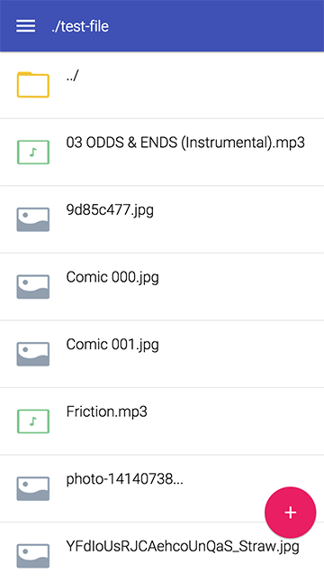
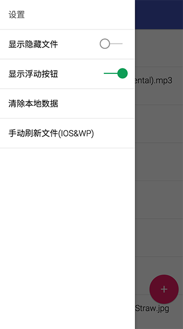
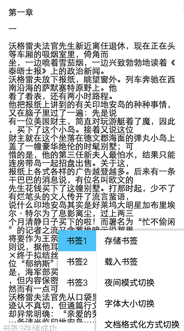

# Mobile-OnlineStorage

##简介
本WEBAPP支持通过局域网/互联网查看和下载本地文件 
并支持了一部分常用格式的文件的查看和基本功能  
所谓基本功能其实就是文字（书签）图片（翻页）音乐（循环）这样的类APP功能 
所以其实这是一个因为作者懒得往手机里导入数据的产物...... 
果然懒才是第一生产力啊 (￣▽￣")   

##使用说明
环境：MAC OS + Android/IOS/WindowPhone  

1.开启MAC的文件共享功能（系统偏好设置>共享>文件共享） 
2.复制dist目录下文件到公共文件夹（即"User/用户名/Public"） 
3.运行一次create-tree.command 
4.用移动设备的浏览器访问你的共享地址（文件共享设置里有写） 
5.躺在床上玩手机~\\(≧▽≦)/~  

其他：每次添加新文件的时候都要运行一次create-tree.command，手机则要下拉刷新一次   

##界面预览

   

##备注
源码很乱而且未优化性能，作者还在进化的路上，将来有机会再重写吧 
还有说好的IE11很好用呢？WP版IE11的API就是一坨热翔！！！ 
所以WP无法使用下拉刷新功能...请手动点击设置里刷新数据